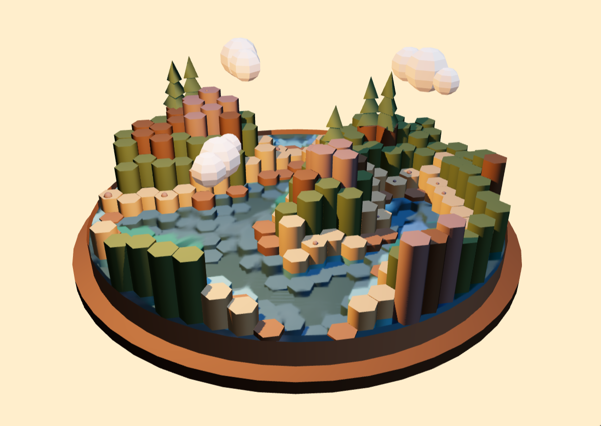

# Procedural Hexagons

A fun little app written in Typescript with [react-three-fiber](https://github.com/pmndrs/react-three-fiber) to procedurally generate hexagonal maps that include rocks, trees, and clouds.

## Installation

First clone the repo and install the required dependencies.

```
git clone git@github.com:jarenglenn/procedural_hexagons.git
cd procedural_hexagons
npm install
```

Then start the server using

```
npm start
```

## Example Output


